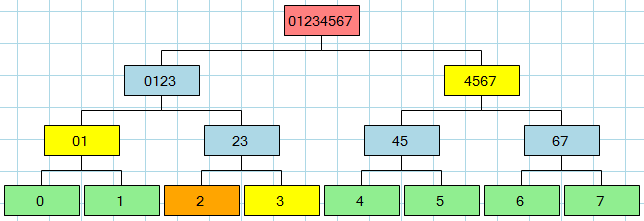

# What this is about

First assignment for the course of Distributed and Concurrent Programming (Programmazione Concorrente e Dstribuita) AA. 2018/2019 

Due delivery: November 27, 2018. h.23:59

## Getting Started

The exercises are build using the Gradle build system which should be available by default in our lab. PCs. 
Below are reported some preliminary (not exhaustive) steps needed to setup up the work environment

### Prerequisites

First, and to be sure, check that the gradle build system is available in your current system by issuing the following command:

```
1. gradle -v
```
if the output is what is expected than proceed with the next step, otherwise refer to 
* [Gradle](https://gradle.org/install/) - Build System
for the installation tips for your system.

The second step is to check whether you have git (version control system) installed in your local environment

```
2. git --version
```
if the output is what is expected than proceed with the next step, otherwise refer to
* [git](https://git-scm.com/downloads ) - Version Control System
for the installation tips for your system.

### Getting the project sources

After you have setup the necessary tools needed to retrieve and build the project go on and clone the repository by issuing a 

```
3. git clone git clone https://albadmin@bitbucket.org/albadmin/pcd1819-mod1exer.git
4. cd pcd1819-mod1exer
```

Once you have retrieved and positioned in the right directory you can build the project as follows:

```
5. gradle build -x test 
```

Gradle will automatically download the necessary project files and definitions needed for this project to compile (i.e., the JUnit library needed for testing).
If the command was successful, a 'build' directory has been created, containing other directories, among them a /class directory containing the compiled sources.

To execute the unit tests go on and type:

```
6. gradle test
```

### IDE Import

You can import the project in your favourite IDE by following the available Import Gradle Project-like wizzard.

## The Exercises
The code is commented and you should fill in the missing implementation. Some test cases are there to help guide you during the development process.
Pay careful attention to them! You can add additional helper methods if you retain them useful.



Some explanation is due for the 'merkleClient' exercise which takes its name from a well-known hash data structure called a * [Merkle Tree](https://en.wikipedia.org/wiki/Merkle_tree). The data structure has performance benefits w.r.t to linear hash data structures e.g., proof that a transaction is valid is computed in O(log_n) time with n being the overall number of transactions.

Our exercise models a scenario whereby a client asks an authority (the server) to provide a proof that a transaction it holds (the client) is valid or not. The server holding the entire or parts of the Merkle Tree provides the client with all the necessary information needed to perform this computation. 

This exercise makes the following assumptions: 

1. the client knows the hash of the merkle tree root;

2. the server sends the client a linear sequence of hash values.

Once the client receives the linear sequence of hashes can proceed to compute the resulting root hash value. A transaction is considered valid if the computed root hash value matches the one the client has. In the Figure above, the client asks the server to provide a proof for the transaction with content=2. The client responds with the values 3, 01, 4567. Upon receiving the response the client has the necessary information to compute 
the root hash. 

Note: The actual contents stored at the nodes are hash values computed over the content of the transaction. It is assumed that client
and server use the same cryptographic primitives.

Note: No modeling of the Merkle data structure is required i.e., the server 
simply sends a sequence of hash values used to compute the root hash.

Note: No server implementation is required. For this purpose, one could use the server implementation
discussed during the lectures. 

Note: Exception handling of events occurring in the client side is very important.

## Project Delivery

Below you can find some details regarding exercise delivery and grading strategy

### How
The delivery will happen via email, sent to me following these criteria: 
(1) The email subject adheres to the following format: [pcd] Name Surname Student_Identifier, the textual contents of the email
are not important but you can repeat the subject (e.g., [pcd] pinco palino 123432). 
(2) The source files comprising the 'src' directory the 'settings.gradle' and 'build.gradle' should be wrapped inside a root directory named
according to the format name-surname-studentIdentifier (e.g., pinco-pallino-123432) and compressed. Only the compressed file should be sent through email. 


Directory structure example:

```
pinco-pallino-123432 
│   build.gradle
│   settings.gradle
│
└───src

```

** Note that no external archives should be referenced in you project. **

Failure to meet these criteria can result in you project not being evaluated.

### Grading and Written Exam

As explained during the classes, exercises amount to 3 points and are mandatory. You can sustain the written exam evenif you have not delivered the exercises. However, after each exam session the maximum amount of points will age with a factor of \alpha, that is the roof is computed as: 3 - \alpha * 3. In order to abtain a final vote for the exam, the student should have passed the written exam and delivered the exercises.

Due delivery: November 27, 2018. h.23:59

